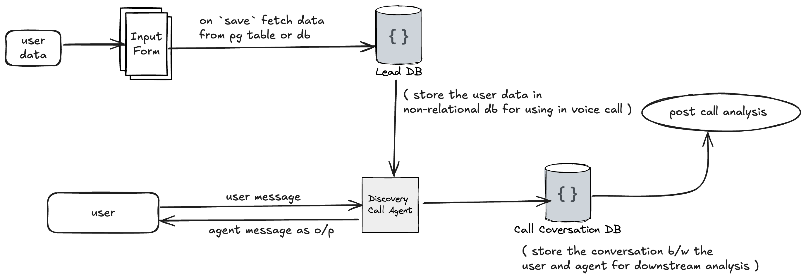

## Setup

1. **Clone the repository:**

   ```bash
   git clone https://github.com/yourusername/your-repo-name.git
   cd your-repo-name
   ```

2. **Install dependencies with Poetry:**

   ```bash
   poetry install
   ```

3. **Set up environment variables:**

   Create a `.env.local` file in the project root with your API key:

   ```
   OPENAI_API_KEY=your_openai_api_key_here
   add other required secrets taking ref from `.env.example`
   ```

## Usage

1. **Install dependencies (if not already done):**

   ```bash
   poetry install
   ```

2. **Activate the Poetry virtual environment:**

   ```bash
   poetry shell
   ```

3. **Run the main analysis agent in console mode:**

   ```bash
   python src/agent.py console
   ```

## Poetry Commands

- **Add a new dependency:**

  ```bash
  poetry add <package-name>
  ```

- **Run tests (if you have them):**

  ```bash
  poetry run pytest
  ```